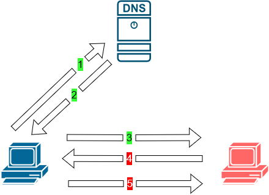
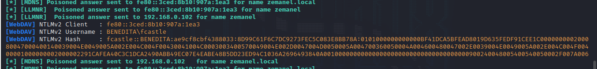
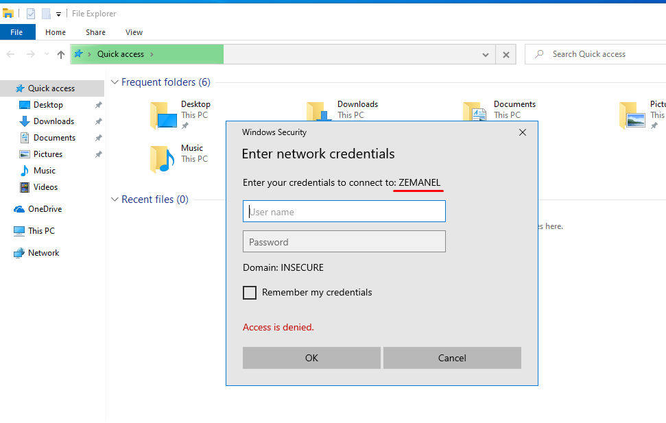
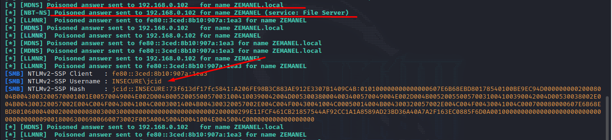
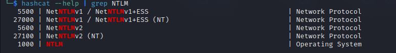
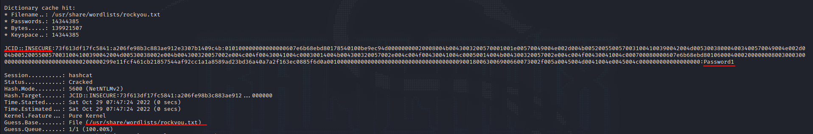

## Definição

**LLMNR** é um acrónimo de _Link-Local Multicast Resolution_, está activo por defeito e é usado para resolução de nomes quando não existe resposta do DNS ao pedido.

Na pratica é enviado, em ultimo recurso, um pedido para todo o segmento de rede onde a máquina se encontra na tentativa que o pedido seja satisfeito por alguem que esteja na mesma rede.

A vulnerabilidade deste serviço existe porque quando respondemos ao pedido é nos enviado o user e a hash da password, que pode ser extraida dependendo da complexidade da mesma.

É um ataque do tipo **Man in the Middle (MITM)**, em que o atacante responde ao pedido e guarda informação de acesso do utilizador.



1. O utilizador quer resolver o nome \\\ZEMANEL;
2. O DNS falha em responder porque não conhece o nome;
3. É enviado para a rede o mesmo pedido por LLMNR;
4. A maquina do atacante diz que é ela;
5. É enviado o user e o hash da password para o atacante.

Desta forma o atacante fica com a possibilidade de extrair a password do hash que recebeu, iniciando assim o primeiro passo para acesso ao dominio.

## Exploração (Poc)

- Iniciar o responder

```Bash
sudo responder -I eth0 -wd
```



- o utilizador tenta aceder a uma drive de rede que não existe.



- O responder indica ao utilizador jcid dizendo que é ele o destino e é enviado o user e a hash da password



- Copiamos a hash para um ficheiro e iniciamos o processo de extração da password a partir da hash.


- Iremos utilizar a ferramenta hashcat para o efeito, existem outras opções como o **John the ripper**

- 1. O tipo de hash é NTLMV2



- 2. ` hashcat -m 5600 jcid.hash /usr/share/wordlists/rockyou.txt`



E a partir deste momento ja conhecemos o user/dominio assim como a password do utilizador, neste ponto podemos iniciar a exploração da Active Directory, visto que já temos credenciais validas.

## Informação adicional

Este tipo de ataque é muito eficaz logo pelo manhã quando os utilizadores chegam ao local de trabalho e depois de almoço. Visto que nessa altura é queando estes começam a aceder a drives partilhadas e/ou a outros serviços.

## Mitigação

- Em "Group Policy Editor" > Local Computer Policy > Computer Configuration > Administrative Templates > Network > DNS Client colocar **"Turn OFF Multicast Name Resolution"** como disable.
